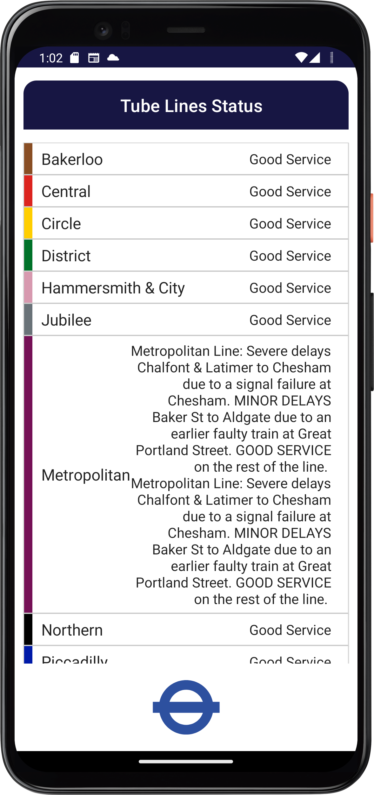
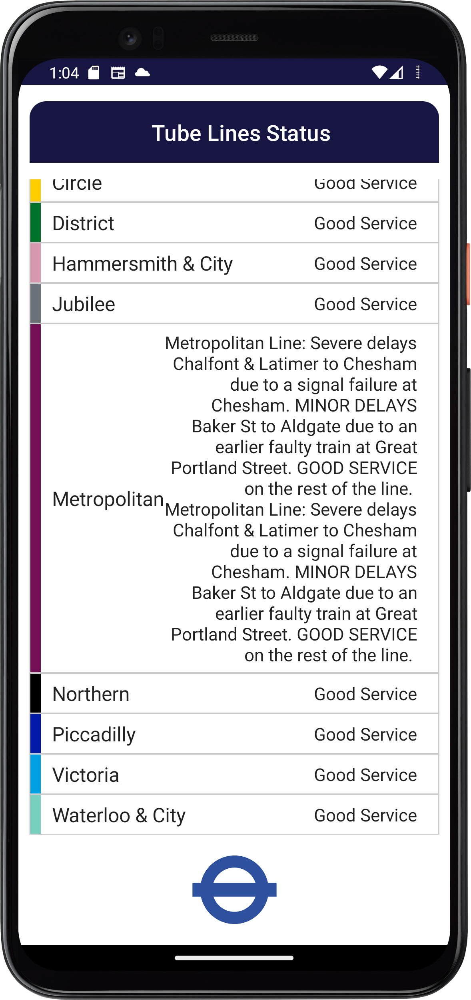
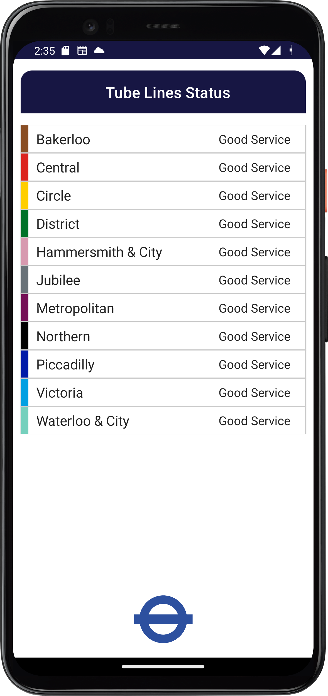

# TfL-Coding-Challenge-Tesfahun
It is a simple coding challenge to demonstrate the clean code architecture and implement accessibility feature.
In order to run the app, clone this repository and open in the android studio and run it to  emulator or or physical android device.  
## Tech stack
- Compose - To design the UI
- Clean code architecture - As an architecture MVVM on top of it
- Dagger Hilt - As dependancy injection
- Retrofit Type - For api calls
- Coroutines - For asynchronous execution
- Flow -  A flow is conceptually a stream of data that can be computed asynchronously.

Testing 
- Flow Test - Testing flows using Turbine 
- FakeRepository - To test viewModel fake repository with dummy data is created

# Some UI screenshots 

    
